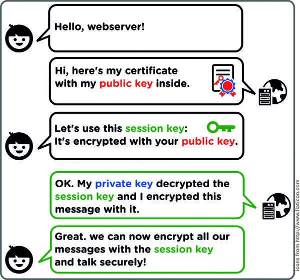
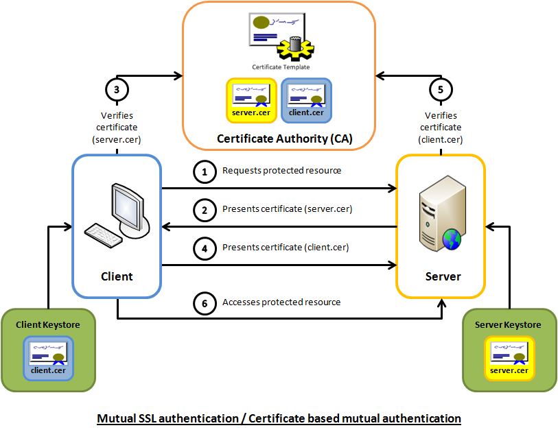

## CERTIFICATE GENERATION

- Generate generic CSR:
```
openssl req -new -newkey rsa:2048 -nodes -keyout server.key -out server.csr
```

- Generate CSR with Subject Alternate Names: (See ./certgen.sh for script):
```
sh ./certgen.sh domain.example.com 'DNS:*.domain.example.com,IP:10.0.0.10'
```

- Generate self-signed certificate:
```
certtool --generate-privkey --outfile key.pem
certtool --generate-self-signed --load-privkey key.pem --outfile cert.pem
```

- Add private key to certificate. This allows the cert and private key to be imported into Windows: <sup>[3]</sup>
```
openssl pkcs12 -export -out cert.pfx -inkey private.key -in cert.crt -certfile CACert.crt
```

- Convert `.pem` to `.crt` format:
```
openssl x509 -outform der -in cert.pem -out cert.crt
```


---
## SSL CERTIFICATES (1-way SSL Authentication)

  Before Bob sends Alice data that's been encrypted with ker Public Key, it is important for Bob to verify Alice's Public Key belongs to her and not a malicious third party impersonating Alice by giving Bob the wrong Public Key.

  To verify Alice's Public Key belongs to her, Bob checks the Alice's Certificate, which contains her Public Key. The Certificate also has the Digital Signature of a Certificate Authority (CA) verifying its authenticity, since the CA is a trusted third-party.

  The CA that signed Alice's Certificate is an Intermediate CA, which Bob doesn't trust. However, the Intermediate CA's Certificate was signed by a Root CA, which Bob trusts. Through the Chain of Trust, since Bob trusts the Root CA, and the Root CA trusts the Intermediate CA, Bob can trust the Intermediate CA.

  Bob can verify the Root CA's signature on the Intermediate CA's Certificate using the Root CA's Public Key, which came built-in on Bob's web browser when he downloaded it, along with the Public Key of every other common Root CA.

Bob trusts the Root CA because it has established its reputation through the Web of Trust, along with the fact that the Root CA's
Public Key came with his browser. <sup>[1]</sup>




---
## MUTUAL SSL AUTHENTICATION (2-way SSL Authentication)

  - In Mutual Authentication, the Client must trust the Server, but the Server must also trust the Client.
  1. The Client requests access to a protected resource.
  2. The Server presents its Certificate to the Client.
  3. The Client verifies the server’s Certificate using the Server's Certificate issuer's Public Key.
  4. If successful, the Client then sends its Certificate to the Server.
  5. The Server verifies the Client’s credentials using the Client's Certificate issuer's Public Key.
  6. If successful, the Server grants access to the protected resource requested by the Client. <sup>[2]</sup>




[1]: https://strongarm.io/blog/how-https-works/
[2]: https://www.codeproject.com/Articles/326574/An-Introduction-to-Mutual-SSL-Authentication
[3]: https://security.stackexchange.com/questions/25996/how-to-import-a-private-key-in-windows
