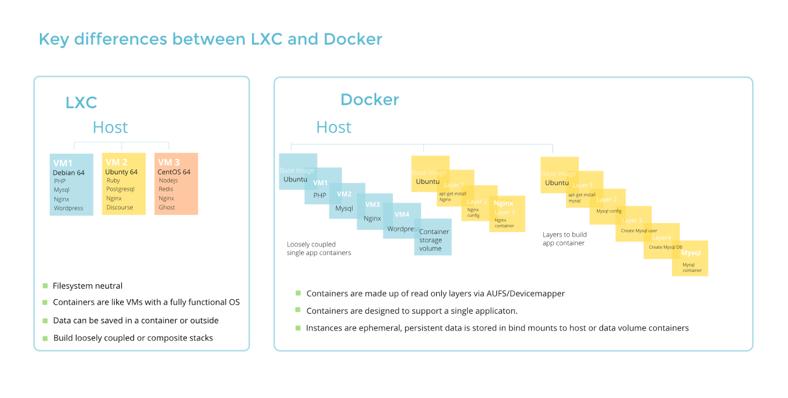

## Containers

- **See also:**
  - [CNCF landscape](https://landscape.cncf.io/)

## [Docker](https://docs.docker.com/)

### Troubleshooting

- Issue:
  ```
  [root@host tkelley]# docker run -it --runtime crun hello-world
  docker: Error response from daemon: OCI runtime start failed: crun did not terminate successfully: exit status 127: crun: error while loading shared libraries: libsystemd.so.0: cannot open shared object file: Operation not permitted
  : unknown.
  ERRO[0000] error waiting for container: context canceled
  
  [root@host tkelley]# docker run -it --runtime crun hello-world
  docker: Error response from daemon: failed to create task for container: failed to create shim task: OCI runtime create failed: unable to retrieve OCI runtime error (open /var/run/docker/containerd/daemon/io.containerd.runtime.v2.task/moby/e4299f10a6f953d2b0821b133aaf25eae24ebf3fddfed8f80b800b72947d86c7/log.json: no such file or directory): crun did not terminate successfully: exit status 127: crun: error while loading shared libraries: libsystemd.so.0: cannot open shared object file: Operation not permitted
  : unknown.
  ERRO[0000] error waiting for container: context canceled
  ```
  - Solution: disable fapolicyd
    ```
    systemctl stop fapolicyd
    ```


### Permissions

- `usermod -a -G docker akelley && newgrp docker` = Add user to *docker* group, reload group membership

### Building

- `docker build -t mycontainer:latest .` = Build container in current context with name *mycontainer*.
- `docker run -it mycontainer` = Run container and attach to its shell.

### Swarm

- `docker stack rm zabbix` = Remove zabbix stack.
- `docker stack deploy zabbix -c zabbix-stack.yml` = Deploy zabbix stack using the *zabbix-stack.yml* file.

### Managing

- `docker rm -f $(docker ps -aq)` = Remove all stopped containers.
- `docker image rm $(docker image ls -q)` = Remove all images.
<br><br>
- `docker exec -it bitbucket /bin/bash` = Enter a shell in the bitbucket container.
<br><br>
- `docker stack services -q jitsi | xargs -L1 -I{} sh -c 'docker service logs -f {} &'` = Tail combined logs for all services in the jitsi stack.
- `pkill -f 'docker service logs'` = [Stop logs.](https://github.com/moby/moby/issues/31458)
<br><br>
- Add `:z` to end of volume mount to prevent SELinux from denying the container access:
```yaml
 db_data_mysql:
  image: busybox
  volumes:
   - ./env/var/lib/mysql:/var/lib/mysql:z
```


---
## [Podman](https://docs.podman.io/en/latest/#)

- **See also:**
  - [Podman networking](https://www.redhat.com/sysadmin/container-networking-podman)
  - [Moving from Docker to Podman](https://www.redhat.com/sysadmin/compose-podman-pods)


---
## [LXC](https://linuxcontainers.org/lxc/introduction/)




---
### Container implementations comparison
```
 Application Containers (Docker, Podman)
┌───────────────┐   ┌───────────────┐
│  Application  │   │  Application  │
├───────────────┤   ├───────────────┤
│   Container   │   │   Container   │
├───────────────┴───┴───────────────┤
│            OS + Kernel            │
└───────────────────────────────────┘

 OS Containers (LXC/LXD, FreeBSD Jails)
┌─────┐   ┌──────┐ ┌─────┐   ┌──────┐
│App 1│...│App 99│ │App 1│...│App 99│
├─────┴───┴──────┤ ├─────┴───┴──────┤
│ OS + Container │ │ OS + Container │
├────────────────┴─┴────────────────┤
│            OS + Kernel            │
└───────────────────────────────────┘

 Unikernels (ClickOS, IncludeOS)
┌───────────────┐   ┌───────────────┐
│  Application  │   │  Application  │
├───────────────┤   ├───────────────┤
│    Kernel     │   │    Kernel     │
├───────────────┴───┴───────────────┤
│            Hypervisor             │
└───────────────────────────────────┘

 Virtual Machines (KVM, QEMU, Xen, Bhyve)
┌─────┐   ┌──────┐ ┌─────┐   ┌──────┐
│App 1│...│App 99│ │App 1│...│App 99│
├─────┴───┴──────┤ ├─────┴───┴──────┤
│  OS + Kernel   │ │  OS + Kernel   │
├────────────────┴─┴────────────────┤
│            Hypervisor             │
└───────────────────────────────────┘
```
