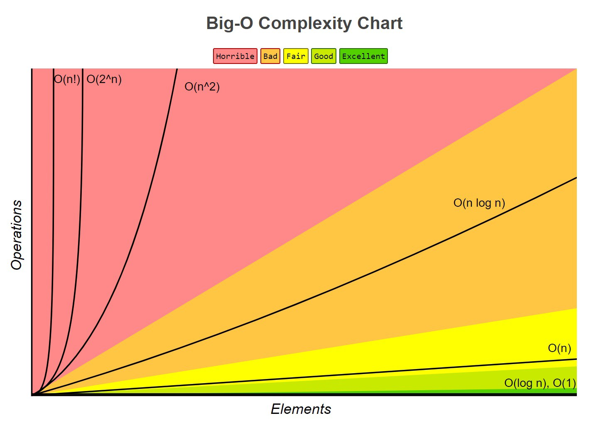

## Cryptography

## Digital signatures

- A digital signature is just an encrypted hash of a file.
- Two keys are used, private key is used for signing, public key is used for verifying signatures.

1. Sender hashes document, encrypts hash with sender's private key, then attaches encrypted hash to file. This
   encrypted hash is the digital signature.
2. Receiver hashes file and decrypts the sender's signature containing the sender's hash using the sender's public key.
3. If the receiver's own hash and the receiver's decrypted hash from the sender match, the signature is valid.

- Provides Integrity, Non-Repudiation, and Authentication.


---
## Data security

| Feature          | Hash | HMAC      | Digital Signature |
|------------------|------|-----------|-------------------|
| Integrity        | Yes  | Yes       | Yes               |
| Authentication   | No   | Yes       | Yes               |
| Non-repudiation  | No   | No        | Yes               |
| Relative Speed   | Fast | Fast      | Slow              |
| Key type         | None | Symmetric | Asymmetric        |
| Can be truncated | Yes  | Yes       | No                |

- **Integrity**: Has the message been altered?
- **Authentication**: Is this entity who they say they are?
- **Non-Repudiation**: Has this entity provided proof that this message actually came from them?
  - Non-Repudiation also provides Authentication as a byproduct.

---
## Symmetric Encryption

> AES, Blowfish, Twofish, RC4, 3DES, One Time Pads, TLS/SSL/HTTPS (data transfer only)

  - A single secret key (called a private key, shared secret, or session key in HTTPS) is used for both encryption and
    decryption of messages after it has been exchanged using public key encryption.
  - Much faster than Asymmetric Encryption since it uses less overhead and its key sizes are smaller.  AES (symmetric)
  - keys are 256-bits, RSA (asymmetric) keys are usually 2048-bits.


---
## KDFs (Key Derivation Functions)

> PBKDF2, scrypt, bcrypt

  - Used to derive a cryptographically-secure symmetric secret key from a less secure password or other input (like a
    shared secret created via a Diffie-Hellman exchange).
  - Very similar to hash functions, but more secure. This is because KDFs produce higher-entropy and more uniformly
    random outputs.
    - Used both to create encryption keys from passwords and to create cryptographically-secure hashes from passwords
  - Keyed-hash MACs (HMACs) are frequently used as part of KDFs. The input for the KDF may be hashed thousands of times
    to increase the difficulty of Brute Force Attacks. This is called a work factor.


---
## MACs (Message Authentication Codes)

> HMAC, PMAC, OMAC

  - Used to ensure data integrity in messages. Similar to digital signatures, except much smaller (only a few bytes) and faster.

  1. The sender uses a MAC algorithm with a shared secret on a message's hash to create a cryptographic checksum, called
     a MAC.
  2. The MAC is attached to the message and sent to the receiver.
  3. The receiver uses the same shared secret with the same MAC algorithm on the message's hash.
  4. The receiver compares his MAC with the sender's MAC. If they match, the message is good and has not been altered en
     route. The receiver also knows that the message definitely came from the sender (and not a Man-in-the-Middle)
     because only the receiver and sender posess the shared secret.

  - Faster than Digital Signatures, but doesn't provide Non-Repudiation because the symmetric key used to sign the hash is not unique to the sender.

### HMACs (Keyed-Hash Message Authentication Codes)

> HMAC-SHA256, HMAC-MD5, HMAC-SHA1

- HMACs are a type of keyed cryptographic hash functions, which are used to dervice MACs.
```
Example:
HMAC-MD5(key="key", message="The quick brown fox jumps over the lazy dog") = 80070713463e7749b90c2dc24911e275
```


---
## Hashing

> - *Unkeyed cryptographic*: MD5 (deprecated), SHA1 (deprecated), SHA2 (SHA256 & SHA512), SHA3, bcrypt
> - *Keyed cryptographic*: HMACs, KMACs, MD6, UMACs, VMACs, BLAKE2
> - *Non-cryptographic*: Buzhash, xxHash, Pearson hashing, MurmurHash
> - *Checksums*: sum8, sum32, fletcher-4, fletcher-32, xor8, Adler-32
>   - *CRCs (Cyclic Redundancy Checks)*: cksum, CRC-16, CRC-32, CRC-64
  - Hashes are one-way functions to ensure data integrity and to obscure/obfuscate passwords.
    - **CRCs** (a common type of checksum) are short and used to detect and/or correct changes in data.
    - **Unkeyed hashes** depend only on input data, intentioanlly designed to be computationally intensive, and are
                         cryptographically secure against brute-force attacks.
    - **Keyed hashes** depend on input data and a symmetric key. Much faster than salted hashes. An HMAC is a type of
                       keyed hash.
  - **Salting:** When hashing passwords, it is recommended to salt them by hashing the user's password concatenated with
                 a random unique string tied to that user's account. This eliminates the effectiveness of rainbow tables
                 because common passwords that have been salted now create hashes different from what would appear on
                 rainbow tables.

| Salted vs Keyed hashes             | Salted hash               | Keyed hash            |
|------------------------------------|---------------------------|-----------------------|
| Primary function                   | Deter brute-force attacks | Ensure data integrity |
| Salt/Key is known to attacker      | Yes                       | No                    |
| Reused between messages            | No                        | Yes                   |
| Relative speed                     | Slow                      | Fast                  |


---
## MFA (Multi-Factor Authentication)

### TOTP (Time-based One-Time Password)
- Used with an Authenticator app that combines a shared symmetric secret key with the current timestamp (on a 30s
  interval) to create a single-use one-time password.
  - An HMAC is used to create the TOTP, which is encoded and truncated down to 6-digits.
  - Only the Authenticator app and the authenticating server know the secret key.
  - Based on HMAC-based One-Time Passwords (HOTP)

### FIDO U2F
`TODO`

## Key Exchange

- Diffie-Hellman
  - Used to securely create a shared secret for a symmetrically-encrypted interaction. A Key-Derivation Function (KDF)
    can then be used with the shared secret in order to create a cryptographically-secure secret key for use with AES.
  - Vulnerable to Man in the Middle attacks if the exchange is not encrypted with RSA.
- Diffie-Hellman-RSA (DH_RSA)
  - DH with RSA
  - Bob uses signs his DH public Key with his RSA private key before sending it to Alice.
  - Alice verifies Bob's signature using his RSA public key to ensure the DH public key is actually from Bob and there
    is no man in the middle.


## Attacks

- **Side-channel attack** = Attack based on a weakness in the implementation of a security system, rather than a
                            weakness in the system itself.
  - **Cold-boot attack** = Attacker with physical access reboots into a temporary OS and performs a memory dump to
                           retrieve encryption keys stored in RAM from the previous boot. Exploits the fact that RAM is
                           unencrypted and remains readable seconds to minutes after losing power. Used to circumvent
                           full-disk encryption.
  - **Cache side-channel attack** = (*e.g. Meltdown & Spectre*) Attacker takes advantage of the way speculative execution
                                    is performed on certain CPUs to gain access to protected areas of memory.
- **Man-in-the-middle attack (MITM)** = Attacker relays or alters messages between two parties who believe they're
                                        communicating with each other.
  - **ARP spoofing / ARP poisoning** = Attacker replies to ARP messages that are requesting the MAC of a specific IP.
                                       This allows the attacker to get their MAC associated with the IP of another host,
                                       usually the default gateway. The attacker can then perform a DoS or MITM attack
                                       by intercepting and relaying traffic.
  - **Replay attack** = Attacker repeats or delays a valid message, fooling a party into believing the attacker is legitimate.


### Breaking encryption

  "Big O" time complexity



  - Classical brute-force time complexity of breaking a cryptographic hash = **O(2<sup>N</sup>)**
    - [A SHA256 hash has a search space of](https://www.youtube.com/watch?v=S9JGmA5_unY&t=1) **2<sup>256</sup>**
  - [Quantum brute-force time complexity of factoring an RSA key using Shor's algorithm](https://cs.stackexchange.com/questions/16684/shors-algorithm-speed) = **O(72(logN)<sup>3</sup>)**


