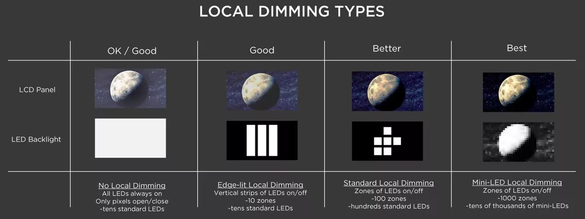

## LCD / TFT LCD [1], [2]

*Liquid Crystal Display*
- Works by shining an LED backlight through a crystal structure, which has three polarization filters for producing
  different levels of red, green, or blue light, based on the voltage applied to it.
- The crystal panel of LCDs can only *block* light, so black pixels are blocked, but the backlight still shines through,
  causing blacks to appear grey.
  
- Panel types
  - TN (Twisted Nematic)
    - Pros: Fastest refresh rates and response times.
    - Cons: Poorest viewing angles, color and contrast.
  - VA (Vertical Alignment)
    - Pros: Best contrast [2], better colors and viewing angles than TN.
    - Cons: Poorest refresh rates and response times, ghosting artifacts.
  - IPS (In-Plane Switching)
    - Pros: Best viewing angles and colors.
    - Cons: Slower response times than TN, issues with "IPS glow" at screen edges.
  
- Backlight technologies
  - Edgelit - Many white LEDs along the edge of the display panel shine inwards.
  - FALD (full array local dimming) - LCD with multiple LED backlight "zones" that can be selectively
    activated/deactivated, increasing contrast in some cases. The resolution of the backlight zones determines much
    "glow" is visible on images with sharp edges of contrast, like white text on a black background.
  - Mini-LED local dimming - Ultra-high resolution local dimming created by extremely small individual white LED
    backlights, reducing backlight glow and increasing contrast. [3]

 [3]

---
## OLED [1], [2]

*Organic Light-Emitting Diode*
- Each pixel emits its own light, brightness is controlled by the voltage applied to the panel.
- Black pixels are completely turned off, allowing for "perfect" contrast.
  - Pros: Excellent contrast capable of HDR, colors, and power efficiency, thinner than LCDs.
  - Cons: Possible image retention issues, more expensive than LCD.

---
## MicroLED

- Each pixel is an individual LED, allowing for nearly all of the benefits of OLED without image retention issues.
- Still an emerging technology.

[1]: https://www.tomshardware.com/reviews/lcd-led-led-oled-panel-difference,5394.html
[2]: https://www.displayninja.com/ips-vs-tn-vs-va/
[3]: https://www.cnet.com/news/mini-led-is-here-how-smaller-lights-could-lead-to-big-tv-improvements/
