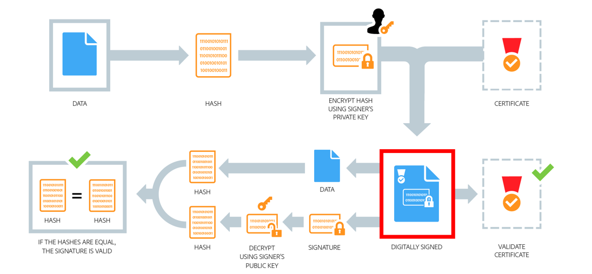

**See also**:
- [The GNU Privacy Handbook](https://www.gnupg.org/gph/en/manual/book1.html)
- [Backing up private keys on paper (1)](https://wiki.archlinux.org/index.php/Paperkey), [(2)](https://www.jabberwocky.com/software/paperkey/), [(3)](https://www.saminiir.com/paper-storage-and-recovery-of-gpg-keys/)


---
## Digitally sign and verify a file

*Assumes recipient does not yet have sender's public key*

### Sender:

1. `gpg --gen-key`                                  = Create public and private key pair.
1. `gpg --output file.sig --detatch-sign file.txt`  = Sign file.txt with private key, producing the signature file file.sig.
1. `gpg --export --armor "pubkey.gpg" > public.asc` = Export binary public key to ASCII-encoded string.
1. Transfer `file.sig`, `file.txt`, and `public.asc` to recipient.

### Recipient:

1. `gpg --import public.asc`                        = Import sender's public key.
1. `gpg --verify file.sig file.txt`                 = Verify the file.sig signature of file.txt using sender's public key.


---
## Asymetrically encrypt/decrypt and sign a file

### Sender:

1. Encrpyt file.txt using recipient's public key (assuming it's in the gpg keychain), then sign file.txt using sender's private key:
  ```bash
  gpg --encrypt --sign --armor --recipient recipient@example.com file.txt
  ```
2. This produces the encrypted and signed file `file.txt.asc`.

### Recipient: <sup>[2], [3]</sup>

1. Decrypt file.txt using recipient's private key and verify sender's signature:
   ```bash
   gpg --decrypt file.txt.asc > file.txt
   ```


---
## Symmetrically encrypt/decrypt a file <sup>[1]</sup>

1. Encrypt file.txt into file.gpg using a password that must be provided:
   ```bash
   gpg --output file.gpg --symmetric file.txt
   ```
1. Decrypt file.gpg into file.txt using the same password used to encrypt file.txt:
   ```bash
   gpg --decrypt file.gpg
   ```


---
## SSL SIGNATURES

  - Two keys are used, Private Key is used for signing, Public Key is used for verifying signatures.
  1. Sender hashes document, encrypts hash with Sender's Private Key, then attaches encrypted hash to document. This encrypted hash is the Digital Signature.
  2. Receiver hashes document and decrypts the Sender's signature containing the Sender's hash using the Sender's Public Key.
  3. If the Receiver's own hash and the Receiver's decrypted hash from the Sender match, the signature is valid.
  - Provides Integrity, Non-Repudiation, and Authentication.




---
## SYMMETRIC ENCRYPTION

> AES, Blowfish, Twofish, RC4, 3DES, One Time Pads, TLS/SSL/HTTPS (data transfer only)

  - A single Secret Key (called a Private Key, Shared Secret, or Session Key in HTTPS) is used for both encryption and decryption of messages after it has been exchanged using Public Key encryption.
  - Much faster than Asymmetric Encryption since it uses less overhead and its key sizes are smaller.
    - AES (symmetric) keys are 256-bits, RSA (asymmetric) keys are usually 2048-bits.


[1]: https://stackoverflow.com/questions/36393922/how-to-decrypt-a-symmetrically-encrypted-openpgp-message-using-php
[2]: https://www.networkworld.com/article/3293052/encypting-your-files-with-gpg.html
[3]: https://www.howtogeek.com/427982/how-to-encrypt-and-decrypt-files-with-gpg-on-linux/
