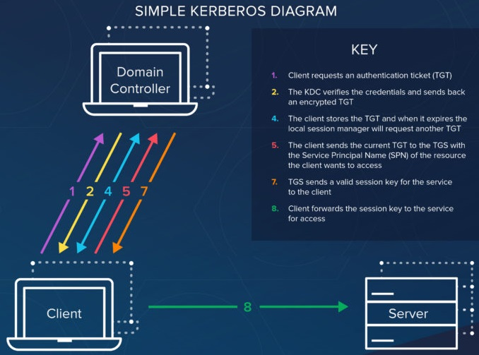

Used to authenticate users to services over an untrusted network, without sending credentials in plaintext. This is done by converting user passwords into symmetric Secret Keys, which are used to encrypt sensitive traffic.

## AUTHENTICATION PROCESS

### 1: TGT authentication

  1. User requests a **Ticket-Granting Ticket (TGT)** from the **Key Distribution Center (KDC)**. This request is encrypted with the user's Secret Key, which was derived from the user's password.
  2. The KDC decrypts the request using the user's Secret Key it has stored in its database.
  3. The KDC gives the user two things:
     1. A TGT that's been encrypted with the KDC's own Secret Key.
     2. A Session Key that's been encrypted with the user's Secret Key.
  4. The user stores the TGT and decrypts the Session Key.

### 2: Ticket authentication

  1. When the user needs access to a service, they send the KDC two things:
     1. Their TGT along with a request to access service X.
     2. An Authenticator, which has been encrypted with the Session Key.
  2. The KDC decrypts the requests:
     1. The KDC decrypts the TGT using its own Secret Key.
     2. The KDC decrypts the Authenticator using the Session Key and compares the user info in the Authenticator with the user info
        in the TGT.
  3. The KDC responds to the user:
     1. The KDC sends a Ticket and new Session Key, both encrypted with service X's Secret Key.
     2. The KDC sends another copy of the new Session Key, encrypted with the old Session Key.
  4. The user stores the Ticket and decrypts the new Session Key.

### 3: Service authentication

  1. User requests access to service X:
     1. The user sends the Ticket and new Session Key, both encrypted with service X's Secret Key, to service X.
     2. The user sends a new Authenticator, encrypted with the new Session Key, to service X.
  2. Service X decrypts the requests:
     1. Service X decrypts the Ticket and new Session Key using its Secret Key.
     2. Service X decrypts the new Authenticator with the new Session Key and compares the user info in the new Authenticator with the
        user info in the Ticket.
  3. Service X responds to the user with a confirmation message encrypted with the new Session Key.
  4. User decrypts the confirmation message and compares its timestamp with the timestamp in the new Authenticator. If they match, the
     user can now begin communicating with service X.

## TERMINOLOGY

  - **principal** = A unique identity that uses Kerberos, usually a username formatted as <USERNAME>@<REALM>.
  - **realm** = The Kerberos-equivalent to a Windows Domain. Realm names are always in all-caps.
  - **SPN (Service Principal Name)** = The formal name of the resource or service a user is requesting access to.
  - **TGS (Ticket-Granting Service)** = The Kerberos service running on the KDC.

  `kinit <USERNAME>@<REALM>` = Request TGT from KDC.
  `klist` = List all tickets.

