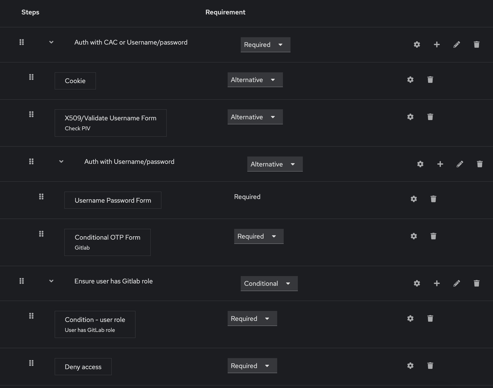
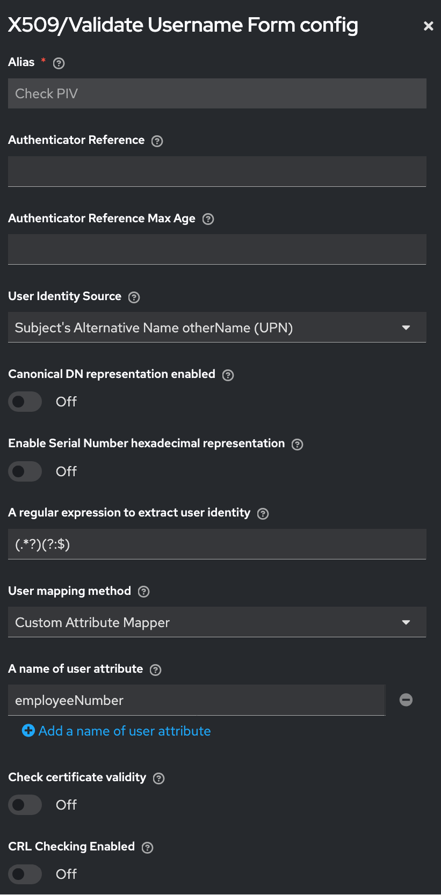

## [Keycloak](https://www.keycloak.org/documentation)

- **See also:**
  - [Red Hat Identity Manager (IDM) docs](https://access.redhat.com/products/identity-management)
 
### Troubleshooting

- Issue: KeyCloak returning `invalid redirect uri` error.
- Solution: In client configuration, ensure `Server base URL` is set.
<br><br>
- Issue: Client returning a signature not found or not available error.
- Solution: In KeyCloak GUI -> Clients -> Select Client -> Settings -> Signature and Encrypion -> Enable both Sign documents and Sign assertions.
<br><br>
- Issue: KeyCloak returning `invalid requester` error. Also, the KeyCloak journal log shows
  ```
  ERROR [org.keycloak.protocol.saml.SamlService] (executor-thread-606) request validation failed: org.keycloak.common.VerificationException:   org.keycloak.common.VerificationException: Invalid query param signature
  ```
- Solution: In KeyCloak GUI -> Clients -> Select Client -> Keys -> Signing keys config -> Disable Client signature required.
    
### Installation

```
yum update -y
amazon-linux-extras install -y java-openjdk11
mkdir /opt/keycloak
cd /opt/keycloak
wget https://github.com/keycloak/keycloak/releases/download/18.0.0/keycloak-18.0.0.zip
unzip keycloak-18.0.0.zip
```

### Starting KeyCloak

  ```
  /opt/keycloak/keycloak-18.0.0/bin/kc.sh --verbose start --https-trust-store-file=./keystore.jks --https-trust-store-password=test123 --https-client-auth=request
  ```
- Build configuration: `./opt/keycloak/keycloak-18.0.0/bin/kc.sh build`
- connect to db and create db
- Show configuration: `./opt/keycloak/keycloak-18.0.0/bin/kc.sh show-config`
- systemd service
  ```ini
  [Unit]
  Description=Keycloak server
  After=network.target

  [Service]
  User=root
  Group=root
  ExecStart=/opt/keycloak/keycloak-18.0.0/bin/kc.sh --verbose start --https-trust-store-file=/opt/keycloak/keycloak-18.0.0/certs/cac_certs.jks --https-trust-store-password=SuperSecretPassword --https-client-auth=request --https-port=443

  [Install]
  WantedBy=multi-user.target
  ```

### API

  - [kcadm guide](https://github.com/keycloak/keycloak-documentation/blob/main/server_admin/topics/admin-cli.adoc)
  -  `../bin/kcadm.sh config truststore --trustpass test1234 ./cac_certs.jks`
  -  `../bin/kcadm.sh config credentials --server https://keycloak.gmcsde.com --realm master --user admin`
  - scripting
    - add users to role
      - `../bin/kcadm.sh get users -r devops --limit 1000 | awk -F: '/username/ {gsub(/,|\"/,""); print $2}' > usernames.txt`
      - `for i in $(cat usernames.txt); do ../bin/kcadm.sh add-roles --uusername "${i}" --rolename agility -r devops; echo "${i}"; done`

### Configuring KeyCloak for CAC authentication (also called mTLS or X509 client authentication)







- keycloak frontend configuration:
  - authentication tab
    - flows
      - CAC browser
        - auth type: X509 validate user form (PIV) - alternative
          - user identity source: suject's alternate name otherName (UPN)
          - canonical DN representation enabled - off
          - enable serial number hexadecimal representation - off
          - a regular expression to extract user identity - `(.*?)(?:$)`
          - user mapping method - custom attribute mapper
          - a name of user attribute - employeeNumber
          - all other toggles - off
        - auth type: cac browser test CAC browser forms - alternative
        - auth type: username password form - required
  - users
    - ensure user has an attribute called `employeeNumber` with a value of their PIV, e.g. `1234567551117275@mil`
- keycloak backend configuration:
  ```ini
  # Example systemd unit for KeyCloak to authenticate users with CACs using mTLS.
  # In our configuration, KeyCloak reads the UPN from the CAC certificate, then matches that to
  #   the employeeName attribute of the correct user in order to match a certificate with a user.
    
  [Unit]
  Description=Keycloak server
  After=network.target
  
  [Service]
  User=root
  Group=root
  ExecStart=/opt/keycloak/keycloak-26.1.0/bin/kc.sh start --https-trust-store-file=/opt/keycloak/certs/trust_store/keycloak_trust_store.jks --https-trust-store-password=supersecretpassword --https-client-auth=request --https-port=443
  
  [Install]
  WantedBy=multi-user.target
  ```
  - keycloak must have a root or intermediate CA certificate in its Java keystore that is the *same* certificate that signs the CAC certificates
     - import certs into a keystore:
       ```
       keytool -import -alias ROOT-CA -keystore keystore.jks -file Root-CA.cer
       ```
     - add DoD root certs to keycloak trust store in order to prompt for cert
     - list certs in trust store:
       ```
       keytool -list -keystore keystore.jks
       ```
  - Dod cert bundle can be downloaded here: https://public.cyber.mil/pki-pke/
    - See the `README.txt` file in the downloaded `.zip` archive for instructions on how to extract certs.
  - Edit `/opt/keycloak/*/conf/keycloak.conf` to add configuration settings.
  - `./opt/keycloak/keycloak-18.0.0/bin/kc.sh build --health-enabled=true`
  - `./opt/keycloak/keycloak-18.0.0/bin/kc.sh show-config`
 
#### Configuring KeyCloak for CAC authentication behind a reverse proxy

- See [this link](https://www.keycloak.org/server/reverseproxy) for KeyCloak docs on using reverse proxies.
- KeyCloak backend configuration:
  - Configure KeyCloak to run in proxy mode and to read the user's certificate from a header. The reverse proxy must populate this header with the user's certificate.
  - Make sure the certificate in the header is `base64`-encoded with NO LINE BREAKS. The entire encoded certificate must be a single line!
    ```ini
    # Example systemd unit for KeyCloak behind an F5 reverse proxy.
    # The reverse proxy authenticates users' CACs, extracts their certificate, then attaches that
    #   certificate to the X-Forwarded-Client-Cert header and forwards the request to KeyCloak.
    # The certificate in the header is base64-encoded on a single line.
    # KeyCloak extracts the certificate in the header, then matches the user using the corresponding
    #   authentication flow (see above).
    # In our configuration, KeyCloak reads the UPN from the decoded certificate, then matches that to
    #   the employeeName attribute of the correct user in order to match a certificate with a user.
    
    [Unit]
    Description=Keycloak server
    After=network.target
    
    [Service]
    User=root
    Group=root
    ExecStart=/opt/keycloak/keycloak-26.1.0/bin/kc.sh start --proxy-headers xforwarded --spi-x509cert-lookup-provider=nginx --spi-x509cert-lookup-nginx-ssl-client-cert=X-Forwarded-Client-Cert --https-trust-store-file=/opt/keycloak/certs/trust_store/keycloak_trust_store.jks --https-trust-store-password=supersecretpassword --https-client-auth=request --https-port=443
    
    [Install]
    WantedBy=multi-user.target
    ```
