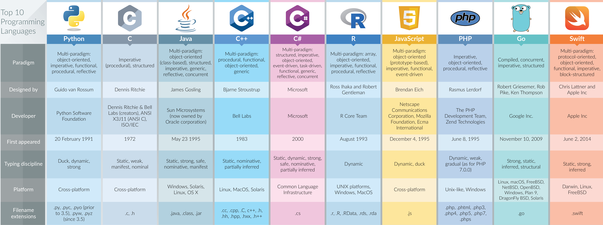

## [PARADIGMS](https://cs.lmu.edu/~ray/notes/paradigms/)

- **Imperative:** Programming with an explicit sequence of commands that update state.
  - **Procedural:** Imperative programming with procedure calls.
  - **Object-oriented:** Programming by defining objects that send messages to each other.
- **Declarative:** Programming by specifying the result you want, not how to get it.
  - **Functional:** Programming with function calls that avoid any global state.


---
## FRAMEWORKS AND RUNTIMES

### [Node.js](https://nodejs.org/en/docs/)

- Released: 2009
- Type: Runtime environment
- Use: Server-side scripting
<br><br>
- Runs JavaScript outside of a browser.

### [.NET](https://dotnet.microsoft.com/)

- Released:
- Type: Framework
- Use:
<br><br>



---
## LANGUAGES

- **See also**
  - [Rosetta code](http://rosettacode.org/wiki/Rosetta_Code)

### [C](https://docs.microsoft.com/en-us/cpp/c-language/?view=msvc-160)

- Examples: Linux kernel
- Paradigm:
- Released: 1972
- Use: Systems, apps, general-purpose
<br><br>

```C
int factorial(int n) {
    int result = 1;
    for (int i = 1; i <= n; ++i)
        result *= i;
    return result;
}
```

---
### [C++](https://docs.microsoft.com/en-us/cpp/cpp/cpp-language-reference?view=msvc-160)

- Examples: Godot engine
- Released: 1985
- Use: Systems, apps, games
<br><br>
- Most 3D games are written in C++.
- Strong focus on performance and efficiency.

```C++
long long int factorial(long long int n)
{
   long long int r = 1;
   while(1<n)
       r *= n--;
   return r;
}
```

---
### C#

- Examples:
- Released: 2000
- Use: Apps, web
<br><br>
- Microsoft's .NET answer to Java.
- Heavily object-oriented compared to C or C++.

---
### [COBOL](https://www.wikiwand.com/en/COBOL)

*Common Business-Oriented Language*

- Examples:
- Released: 1959
- Use: Business, legacy support, mainframes, transaction processing
<br><br>
- Mostly dead, all current work in COBOL is to maintain older apps.

```cobol
       IDENTIFICATION DIVISION.
       FUNCTION-ID. factorial.

       DATA DIVISION.
       LOCAL-STORAGE SECTION.
       01  i      PIC 9(10).

       LINKAGE SECTION.
       01  n      PIC 9(10).
       01  ret    PIC 9(10).

       PROCEDURE DIVISION USING BY VALUE n RETURNING ret.
           MOVE 1 TO ret

           PERFORM VARYING i FROM 2 BY 1 UNTIL n < i
               MULTIPLY i BY ret
           END-PERFORM

           GOBACK
           .
```

---
### CSS

*Cascading Style Sheets*

- Released: 1996
- Use: Style sheet for presentation
<br><br>
- Used to describe how HTML is presented on a web page.
- Cornerstone of the web, along with HTML and JavaScript.

```css
body {
   overflow: hidden;
   background-color: #000000;
   background-image: url(images/bg.gif);
   background-repeat: no-repeat;
   background-position: left top;
}
```

---
### Fortran

- Examples:
- Released: 1957
- Use: Numerical, scientific, high-performance computing
<br><br>
- Oldest high-level language.

```fortran
     FUNCTION FACT(N)
     INTEGER N,I,FACT
     FACT=1
     DO 10 I=1,N
  10 FACT=FACT*I
     END
```

---
### [Go](https://golang.org/)

- Examples: Docker, Ethereum, OpenShift, Kubernetes, Terraform
- Released: 2009
- Use: Applications, web, server-side, cloud
<br><br>
- Design heavily influenced by C.

```go
package main

import (
    "fmt"
    "math/big"
)

func main() {
    fmt.Println(factorial(800))
}

func factorial(n int64) *big.Int {
    if n < 0 {
        return nil
    }
    r := big.NewInt(1)
    var f big.Int
    for i := int64(2); i <= n; i++ {
        r.Mul(r, f.SetInt64(i))
    }
    return r
}
```

---
### [Haskell](https://www.haskell.org/)

- Examples: Xmonad window manager, Git-annex
- Released: 1990
- Use: Applications
<br><br>

```haskell
factorial n = if n < 2
              then 1
              else n * factorial (n - 1)
```

---
### HTML

- Released:
- Use:
<br><br>

```html
<!DOCTYPE html>
<html>
  <head>
    <meta charset="utf-8">
    <style>
    #xyz { color: blue; }
    </style>
  </head>
  <body>
    <p id="xyz" style="color: green;"> To demonstrate specificity </p>
  </body>
</html>
```

---
### Java and Kotlin

- Examples:
- Released: 1995
- Use: Apps, web, general-purpose
<br><br>
- "Write once, run anywhere".
- Known for verbose syntax.
- Kotlin (released 2011) is a related Java-compatible language developed by JetBrains.

```java
public class HelloWorldApp {
    public static void main(String[] args) {
        System.out.println("Hello World!"); // Prints the string to the console.
    }
}
```

---
### [JavaScript](https://www.javascript.com/)

- Examples:
- Released: 1995
- Use: Web apps, client-side web scripting
<br><br>
- Enables interactive web pages.

```javascript
function factorial(n) {
    if (n === 0)
        return 1; // 0! = 1

    return n * factorial(n - 1);
}

factorial(3); // returns 6
```

---
### [Lua](https://www.lua.org/)

- Examples:
- Released: 1993
- Use: Scripting
<br><br>
- Designed for embedded use within applications.
- Lightweight and portable.

```lua
function factorial(n)
  local x = 1
  for i = 2, n do
    x = x * i
  end
  return x
end
```

---
### Lisp

*LISt Processing*

- Dialects: [Clojure](https://clojure.org), [Common Lisp](https://lisp-lang.org/), Emacs Lisp, Racket, Scheme
- Examples: Emacs, Grammarly
- Paradigm: Functional, procedural
- Released: 1958
- Use: AI, scripting, apps
<br><br>
- Technically a family of programming languages.
- Recently seen a resurgence
- Known for heavy use of parentheses and prefix-style syntax.
- Second-oldest high-level language (behind Fortran by 1 year).

```lisp
 (defun factorial (n)
   (if (= n 0) 1
       (* n (factorial (- n 1)))))
```

---
### [Pascal](https://www.britannica.com/technology/Pascal-computer-language)

- Examples:
- Paradigm: Procedural
- Released: 1970
- Use:
<br><br>
- Emphasis on structured programming.
- Designed to improve upon ALGOL, FORTRAN, and COBOL.
- Popular in the 1970s and 80s.
- Replaced by C and C++

```pascal
function factorial(n: integer): integer;
 var
  i, result: integer;
 begin
  result := 1;
  for i := 2 to n do
   result := result * i;
  factorial := result
 end;
```

---
### Perl and Raku

- Examples: Urxvt terminal extensions
- Paradigm:
- Released: 1987 (Perl), 2019 (Raku)
- Use: General-purpose, scripting, text parsing
<br><br>
- Old and possibly dying.
- Perl 6 became Raku, a separate project.
- Originally used in early internet back-end code.
- Regular expressions in Linux originate from Perl.
- Popular as a "glue language".
- Perceived to be inelegant due to its unplanned development.

```perl
sub factorial
{
  my $n = shift;
  my $result = 1;
  for (my $i = 1; $i <= $n; ++$i)
  {
    $result *= $i;
  };
  $result;
}
```

---
### PHP

- Examples: Zabbix, PfSense, OPNSense
- Released:
- Use:

---
### [Python](https://www.python.org/)

- Examples: Ansible, Openstack, Blender, Ranger file browser
- Paradigm: Multi-paradigm, but [leans towards object-oriented](https://www.coursereport.com/blog/ruby-vs-python-choosing-your-first-programming-language)
- Released: 1991
- Use: General-purpose, scripting, machine learning, data science
<br><br>
- Designed to be easy to read (uses whitespace instead of brackets).
- Extremely popular.
- Good first language.

```python
n = 23
fact = 1

for i in range(1,n+1):
    fact = fact * i

print (fact)
```

---
### [Ruby](https://www.ruby-lang.org/en/)

- Examples: Puppet, Chef, Ruby on Rails, Homebrew, Metasploit, Vagrant
- Paradigm: Strictly object-oriented
- Released: 1995
- Use: General-purpose, scripting
<br><br>
- Designed to be productive and fun, focused on humans rather than computers.
- Follows the Principle of Least Astonishment and attempts to [minimize programmer confusion](https://www.coursereport.com/blog/ruby-vs-python-choosing-your-first-programming-language)

```ruby
def factorial(n)
 if n == 0
  return 1
 else
  return n * factorial(n-1)
 end
end
```

---
### [Rust](https://www.rust-lang.org/)

- Examples: Ripgrep, Alacritty terminal, Firefox's Servo engine
- Released: 2010
- Use:
<br><br>
- Focused on safety, especially safe concurrency.
- One of the most loved languages in StackOverflow's developer survey.

```rust
fn factorial_recursive (n: u64) -> u64 {
    match n {
        0 => 1,
        _ => n * factorial_recursive(n-1)
    }
}

fn factorial_iterative(n: u64) -> u64 {
    (1..=n).product()
}

fn main () {
    for i in 1..10 {
        println!("{}", factorial_recursive(i))
    }
    for i in 1..10 {
        println!("{}", factorial_iterative(i))
    }
}
```

---
### [Scala](https://scala-lang.org/)

- Examples:
- Released:
- Use:
