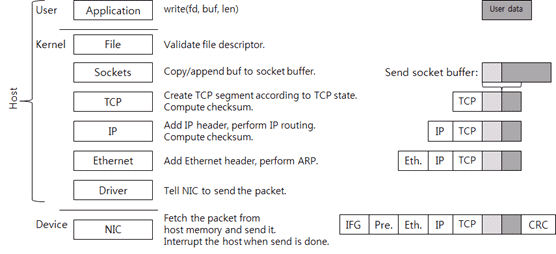

## CURL

Make POST API request to a Zabbix server:
```bash
curl -v -d '{"jsonrpc": "2.0", "method": "host.get", "params": {"startSearch": {"name": "BlaBlaBla"}}, "id": 1, "auth": "f0fe38b3994cd953403477016e"}' -H "Content-Type: application/json-rpc" http://zabbix-server.example.com/api_jsonrpc.php
```

## FIREWALLD

- **See also:**
  - [Using Firewalld on CentOS 7](https://www.digitalocean.com/community/tutorials/how-to-set-up-a-firewall-using-firewalld-on-centos-7)

Allow HTTPS traffic in the public zone:
```bash
firewall-cmd --zone=public --permanent --add-service=https
firewall-cmd --reload
```

Disallow port 123 TCP traffic in the block zone.
```bash
firewall-cmd --zone=block --permanent --remove-port 123/tcp
firewall-cmd --reload
```

### firewall-cmd options

- `--list-ports` or `--list-services` = Show allowed ports/services.
- `--list-all-zones` = Show firewalld rules for both public and private zones.
<br><br>
- `--state` = Check if firewalld is running.
- `--zone=private --add-interface=ens32` = Attach zone to network interface.


---
## IPTABLES

> NOTE: `iptables` has been deprecated in favor of `nftables` <sup>[4]</sup>

- `iptables -L` = Show firewall ruleset.

Add new rule to allow port 80 traffic both to and from host:
```bash
iptables -A INPUT -i eth0 –p tcp --dport 80 –m state --state NEW,ESTABLISHED –j ACCEPT
iptables –A OUTPUT -o eth0 –p tcp --dport 80 –m state --state NEW,ESTABLISHED –j ACCEPT

iptables –A INPUT -i eth0 –p tcp --sport 80 –m state --state NEW,ESTABLISHED –j ACCEPT
iptables –A OUTPUT -o eth0 –p tcp --sport 80 –m state --state NEW,ESTABLISHED –j ACCEPT
```


---
## IP

### Interfaces

- `ip a add 192.168.1.200/24 dev eth0`         = Add IP to device.
- `ip a del 10.0.0.10/24 dev enp12s0`          = Remove IP from device.
- `ip route add DEFAULT via 10.0.0.1 dev eth0` = Add default gateway to device.
<br><br>
- `ip link set dev eth1 up` = Enable interface eth1.

### Configuration

- `ip n show` = Show neighbor/ARP cache.
- `ip r`      = Show routing table.
- `ip a`      = Show network interfaces and IP addresses.
<br><br>
- `/etc/sysconfig/network` = See default gateway.
- `/etc/sysconfig/network-scripts/ifcfg-<INTERFACE>` = Networking device interface options.
<br><br>
- `route add default gw 192.168.1.1 eth0` = Manually add default gateway.
- `traceroute <DOMAIN_NAME>` = Print the route that packets take to a given destination.


---
## PORTS

### Remote ports

- `nmap -p <PORT> <IP>` or `telnet <IP> <PORT>` = Ping specific TCP port on host.
<br><br>
- `nc -zvu <IP> <PORT>` = Ping specific UDP port on host.
  - `-z` = Zero I/O mode, show only if connection is up/down.
  - `-v` = Verbose.
  - `-u` = Query UDP instead of TCP.
<br><br>
- `nmap -p 22 192.168.1.0/24`      = Scan for every host on subnet with port 22 open.
- `nmap -p 1-1000 192.168.1.20-40` = Scan TCP ports 1-1000 on hosts within range.
- `nmap -sU localhost`             = Scan localhost for open UDP ports.
<br><br>
- `nmap -sP 10.0.0.0/8` = Attempt to ping all hosts on the 10.0.0.0/8 subnet and list responses.

### Local ports

> NOTE: `netstat` has been deprecated in favor of `ss` <sup>[5]</sup>

- `less /etc/services` = Show ports being used by specific services.
<br><br>
- `netstat -plaunt` or `ss -plunt` = View all open ports.
  - `-p` = Associated process PIDs.
  - `-l` = Only listening ports.
  - `-n` = Numerical IP addresses.
  - `-t` = TCP ports.
  - `-u` = UDP ports.

### VLANS

- **See also:**
  - [How do VLANs work?](https://serverfault.com/questions/188350/how-do-vlans-work?rq=1)
  - [Access ports vs trunk ports](https://www.solarwindsmsp.com/blog/vlan-trunking)


---
## MONITORING & TROUBLESHOOTING

- `iperf` and `iperf3`
- `iftop`
- `ifstat`
<br><br>
- `dig domain.com` or `nslookup domain.com` or `host domain.com` = Perform dns lookup on domain.

### Tcpdump <sup>[2]</sup>

- `tcpdump -tvv` = Dump all packets on all interfaces.
  - `-v` or `-vv` = Extra packet information.
  - `-t` = Human-readable timestamps.
<br><br>
- `tcpdump -i ens32` = Packets on interface ens32.
<br><br>
- `tcpdump host 1.1.1.1`     = Packets going to or from 1.1.1.1.
- `tcpdump src 10.0.0.5`     = Packets coming from 10.0.0.5.
- `tcpdump dst 192.168.1.10` = Packets going to 192.168.1.10.
<br><br>
- `tcpdump -v port 3389`  = Packets on port 3389.
- `tcpdump src port 1025` = Packets coming from port 1025.
<br><br>
- `tcpdump -vvt src 10.0.0.5 and dst port 22` = Packets coming from 10.0.0.5 to port 22.


---
## NTP

> NOTE: `ntpd` has been deprecated in favor of `chrony` <sup>[1]</sup>

- `date +%T –s "16:45:00"` = Manually set time in HH:mm:ss format.
- `date`                   = View current time.

### Chrony <sup>[1]</sup>

Show timekeeping stats:
```
[root@host]# chronyc tracking

Reference ID    : 9B1D9843 (hostname.domain)           # Source NTP server.
Stratum         : 4                                    # Number of NTP server hops to a root NTP server.
Ref time (UTC)  : Wed Dec 11 20:42:51 2019             # UTC time of NTP server.
System time     : 0.000126482 seconds slow of NTP time # Difference between host time and NTP server time.
Last offset     : -0.000039551 seconds                 # Changes made during chrony's last modification.
RMS offset      : 0.001020088 seconds                  # Long-term average offset.
Frequency       : 2.941 ppm fast                       # How much faster/slower the default system clock is from NTP server.
Residual freq   : -0.001 ppm                           # Difference between reference frequency and current frequency.
Skew            : 0.135 ppm                            # Margin of error on frequency.
Root delay      : 0.014488510 seconds                  # Network delay for packets to reach NTP server.
Root dispersion : 0.079814211 seconds
Update interval : 64.3 seconds                         # How frequently chrony modifies the system clock.
Leap status     : Normal                               # Whether a leap second is pending to be added/removed.
                                                       # 1 ppm = 1.000001 seconds.
```

Other useful commands: <sup>[7]</sup>
```bash
chronyc sources -v
chronyc sourcestats
chronyc activity
timedatectl
```


---
## EMAIL

- `mail -s "Test Subject" example@mail.com < /dev/null` = Send test email (using the current host has the SMTP relay).

Send email using a specific SMTP relay:
```bash
echo "This is the message body and contains the message" | \
mail -v                                   \
-r "sender@example.com"                   \  # This is the 'from' field of the email.
-s "This is the subject"                  \
-S smtp="mail.example.com:25"             \  # This is the SMTP relay.
-S smtp-use-starttls                      \
-S smtp-auth=login                        \  # Method to authenticate with SMTP relay.
-S smtp-auth-user="authuser@example.com"  \  # User to authenticate with.
-S smtp-auth-password="abc123"            \  # Password to authenticate with.
-S ssl-verify=ignore                      \  # Don't authenticate SSL.
recipient@example.com                        # This is the 'to' field of the email.
```

### Mail filtering

- `egrep -o 'from=<.*>' /var/log/maillog | sort -u` = Filter sending addresses from maillog.

### Postfix whitelists

1. Add line to `/etc/postfix/main.cf`:
   ```bash
   mynetworks = /postfix-whitelist
   ```
1. Populate `/postfix-whitelist` with IPs.
1. Run `postmap /postfix-whitelist && systemctl restart postfix`.
1. Now only the IPs in `/postfix-whitelist` will be permitted to use the postfix server as an smtp relay.


---
## WGET

```bash
wget                            \
  -A "*.pdf"                    \ # Only keep PDF files.
  -e robots=off                 \ # Ignore robots.txt files.
  --limit 100k                  \ # Limit download speed to 100 KB/s.
  --recursive                   \ # Descend into all subdirectories.
  --no-clobber                  \ # Don't overwrite existing files.
  --page-requisites             \ # Download all files required to display each page properly.
  --html-extension              \ # Explicitly add .html extensions to relevant files.
  --convert-links               \ # Convert http:// to file:// links for offline browsing.
  --restrict-file-names=windows \ # Escape control characters in filenames.
  --no-parent                   \ # Don't include directories above the path provided.
  www.website.org/
  www.website2.org/

  --span-hosts                    # Let wget traverse multiple domains.

wget -A "*.pdf" -e robots=off --limit 100k --recursive --no-clobber --page-requisites --html-extension --convert-links --restrict-file-names=windows --no-parent www.website.org www.website2.org
```


---
## IPv6

| Network   | Purpose                                                                |
|-----------|------------------------------------------------------------------------|
| ::1       | Localhost                                                              |
| fc00::/7  | Unique Local Addresses (ULA) - also known as “Private” IPv6 addresses. |
| fe80::/10 | Link Local addresses, only valid inside a single broadcast domain.     |
| 2001::/16 | Global Unique Addresses (GUA) - Routable IPv6 addresses.               |
| ff00::0/8 | Multicast addresses                                                    |


---
## TCP/IP STACK

 <sup>[1], [2]</sup> 

[1]: https://www.tummy.com/articles/networking-basics-how-arp-works/  
[2]: https://www.cubrid.org/blog/understanding-tcp-ip-network-stack


---
[1]: https://access.redhat.com/documentation/en-us/red_hat_enterprise_linux/8/html-single/configuring_basic_system_settings/index#migrating-to-chrony_using-chrony-to-configure-ntp
[2]: https://danielmiessler.com/study/tcpdump/
[3]: https://danielmiessler.com/study/nmap/
[4]: https://wiki.debian.org/nftables
[5]: https://dougvitale.wordpress.com/2011/12/21/deprecated-linux-networking-commands-and-their-replacements/#netstat
[7]: https://www.thegeekdiary.com/centos-rhel-7-tips-on-troubleshooting-ntp-chrony-issues/
