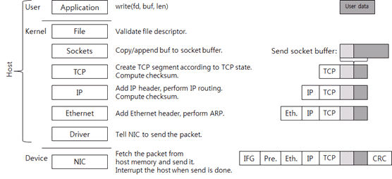

## Networking

## IP

### Interfaces

- `ip a add 192.168.1.200/24 dev eth0`         = Add IP to device.
- `ip a del 10.0.0.10/24 dev enp12s0`          = Remove IP from device.
- `ip route add DEFAULT via 10.0.0.1 dev eth0` = Add default gateway to device.
<br><br>
- `ip link set dev eth1 up` = Enable interface *eth1*.

### Configuration

- `ip n show` = Show neighbor/ARP cache.
- `ip r`      = Show routing table.
- `ip a`      = Show network interfaces and IP addresses.
<br><br>
- `/etc/sysconfig/network` = See default gateway.
- `/etc/sysconfig/network-scripts/ifcfg-<INTERFACE>` = Networking device interface options.
<br><br>
- `route add default gw 192.168.1.1 eth0` = Manually add default gateway.
- `traceroute <DOMAIN_NAME>` = Print the route that packets take to a given destination.


---
## PORTS

### [Remote Ports](https://danielmiessler.com/study/nmap/)

- `nmap -p <PORT> <IP>` or `telnet <IP> <PORT>` = Ping specific TCP port on host.
<br><br>
- `nc -zvu <IP> <PORT>` = Ping specific UDP port on host.
  - `-z` = Zero I/O mode, show only if connection is up/down.
  - `-v` = Verbose.
  - `-u` = Query UDP instead of TCP.
<br><br>
- `nmap -p 22 192.168.1.0/24`      = Scan for every host on subnet with port 22 open.
- `nmap -p 1-1000 192.168.1.20-40` = Scan TCP ports 1-1000 on hosts within range.
- `nmap -sU localhost`             = Scan localhost for open UDP ports.
<br><br>
- `nmap -sP 10.0.0.0/8` = Attempt to ping all hosts on the 10.0.0.0/8 subnet and list responses.
<br><br>
- Windows
  - `Test-NetConnection 10.0.0.15 -port 9000`

### Local Ports

> [NOTE: `netstat` has been deprecated in favor of `ss`](https://dougvitale.wordpress.com/2011/12/21/deprecated-linux-networking-commands-and-their-replacements/#netstat)

- `less /etc/services` = Show ports being used by specific services.
<br><br>
- `netstat -plaunt` or `ss -plunt` = View all open ports.
  - `-p` = Associated process PIDs.
  - `-l` = Only listening ports.
  - `-n` = Numerical IP addresses.
  - `-t` = TCP ports.
  - `-u` = UDP ports.

### VLANS

- **See also:**
  - [How do VLANs work?](https://serverfault.com/questions/188350/how-do-vlans-work?rq=1)
  - [Access ports vs trunk ports](https://www.solarwindsmsp.com/blog/vlan-trunking)


---
## Monitoring & Troubleshooting

- `iperf` and `iperf3`
- `iftop`
- `ifstat`
<br><br>
- `dig domain.com` or `nslookup domain.com` or `host domain.com` = Perform dns lookup on domain.

### [ping](https://stackoverflow.com/questions/22110622/ping-response-request-timed-out-vs-destination-host-unreachable)

- `Destination host unreachable` = Target host doesn't exist or router cannot reach it.
- `Request timed out` = A firewall is dropping the ICMP packets.

### [tcpdump](https://danielmiessler.com/study/tcpdump/)

- `tcpdump -tvv` = Dump all packets on all interfaces.
  - `-v` or `-vv` = Extra packet information.
  - `-t` = Human-readable timestamps.
<br><br>
- `tcpdump -i ens32` = Packets on interface ens32.
<br><br>
- `tcpdump -i ens32 host 1.1.1.1`     = Packets going to or from 1.1.1.1.
- `tcpdump -i ens32 src 10.0.0.5`     = Packets coming from 10.0.0.5.
- `tcpdump -i ens32 dst 192.168.1.10` = Packets going to 192.168.1.10.
<br><br>
- `tcpdump -v -i ens32 port 3389`  = Packets on port 3389.
- `tcpdump -i ens32 src port 1025` = Packets coming from port 1025.
<br><br>
- `tcpdump -vvt -i ens32 src 10.0.0.5 and dst port 22` = Packets coming from 10.0.0.5 to port 22.

---
## Email

- `mail -s "Test Subject" example@mail.com < /dev/null` = Send test email (using the current host has the SMTP relay).

Send email using a specific SMTP relay:
```bash
echo "This is the message body and contains the message" | \
mail -v                                   \
-r "sender@example.com"                   \  # This is the 'from' field of the email.
-s "This is the subject"                  \
-S smtp="mail.example.com:25"             \  # This is the SMTP relay.
-S smtp-use-starttls                      \
-S smtp-auth=login                        \  # Method to authenticate with SMTP relay.
-S smtp-auth-user="authuser@example.com"  \  # User to authenticate with.
-S smtp-auth-password="abc123"            \  # Password to authenticate with.
-S ssl-verify=ignore                      \  # Don't authenticate SSL.
recipient@example.com                        # This is the 'to' field of the email.
```

### Mail Filtering

- `grep -Eo 'from=<.*>' /var/log/maillog | sort -u` = Filter sending addresses from maillog.

### Postfix Whitelists

1. Add line to */etc/postfix/main.cf*:
   ```bash
   mynetworks = /postfix-whitelist
   ```
2. Populate */postfix-whitelist* with IPs.
3. Run `postmap /postfix-whitelist && systemctl restart postfix`.
4. Now only the IPs in */postfix-whitelist* will be permitted to use the postfix server as an smtp relay.


---
## IPv6

| Network   | Purpose                                                                |
|-----------|------------------------------------------------------------------------|
| ::1       | Localhost                                                              |
| fc00::/7  | Unique Local Addresses (ULA) - also known as “Private” IPv6 addresses. |
| fe80::/10 | Link Local addresses, only valid inside a single broadcast domain.     |
| 2001::/16 | Global Unique Addresses (GUA) - Routable IPv6 addresses.               |
| ff00::0/8 | Multicast addresses                                                    |


---
## TCP/IP Stack

- **See also:**
  - [The actual OSI model](https://computer.rip/2021-03-27-the-actual-osi-model.html)
  - [Understanding TCP/IP](https://www.cubrid.org/blog/understanding-tcp-ip-network-stack)
  - [How ARP works](https://www.tummy.com/articles/networking-basics-how-arp-works/)


