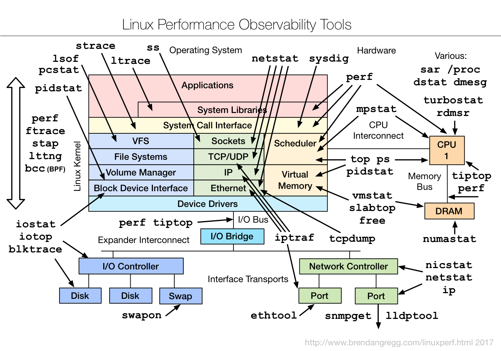

## Processes

- `CTRL-z` = Suspend current foreground job.
- `bg`     = Push most recently suspended job into background.
- `fg`     = Pull most recent background job into foreground.
  
- `ps -efH | less` = View current running process.
  - `-H` = Hierarchy in tree structure.
  - `-e` = Everything.
  - `-f` = Full-format.

### [Signals](https://www.computerhope.com/unix/signals.htm)

| Name      | ID | Hotkey | Description                                     |
|-----------|----|--------|-------------------------------------------------|
| `SIGHUP`  | 1  |        | Process' controlling terminal has been closed   |
| `SIGINT`  | 2  | Ctrl-c | Nicely ask process to cleanup and terminate     |
| `SIGQUIT` | 3  | Ctrl-\ | Ask the process to perform a core dump          |
| `SIGKILL` | 9  |        | Forcefully terminate process, cannot be ignored |
| `SIGTERM` | 15 |        | Identical to `SIGINT`                           |
| `SIGSTP`  | 20 | Ctrl-z | Ask the process to stop temporarily             |

### Status Codes

- `D` = Uninterruptible sleep (CPU waiting for I/O to complete).
- `S` = Interruptible sleep (waiting for event).
- `T` = Stopped by job control signal.
- `R` = Running or in run queue.

### Commands

- `top -u alice` = Show user alice’s currently running processes, use O to sort by column.
- `kill -s 9 7423` or `kill -9 7423` = End process with PID 7423 by sending it a `SIGKILL` signal.
  
- `exec bash`        = Restart bash shell.
- `strace [command]` = Trace system call.

## `top` Command

### Upper Section

- `15:39:37`          = System time.
- `up 90 days, 15:26` = Uptime in days, hours:minutes.
  
- `load average: 0.00, 0.00, 0.00` = Average total system load over 1min, 5min, 15min.
- (a value of 1 indicates one cpu core is fully occupied) (cat /proc/cpuinfo to find # of cores).
    - ex. for a single-core system -- `0.4` = Cpu at 40% capacity, `1.12` = Cpu 'overloaded' by 12% capacity.
    - ex. For a quad-core system – `1.0` = 3 cores idle, 1 core at full capacity, or all cores at 33% load (on average).
    - ex. `5.35` = System overloaded at 135% capacity, `1.35` processes were waiting for cpu time during the specified interval (1min, 5min or 15min.
  
- `%cpu(s):` = Cpu time usage statistics, in % of total cpu time available.
  - `us` = % cpu time running userpace processes.
  - `sy` = % cpu time running kernel processes.
  - `ni` = % cpu time running processes with manually set nice value (lower nice value = higher priority).
  - `id` = % cpu time idle (likely in a power save mode).
  - `wa` = % time cpu waiting for I/O requests to complete (e.g. waiting for HDD to locate and read data.
  - `hi` = % cpu time handling hardware interrupts (keyboard & mouse events, peripherals, etc).
  - `si` = % cpu time handling software interrupts.
  - `st` = (virtualized environments) % time OS is waiting for cpu to finish executing processes on another VM (st for steal).

### Lower Section

- `PID`     = Process ID.
- `USER`    = Process' 'effective' username.
- `PR & NI` = Priority & nice value, a lower nice value correlates to higher priority.
- `VIRT`    = Total memory consumed (includes physical memory and swap).
- `RES`     = Physical memory consumed.
- `SHR`     = Memory shared with other processes.
- `S`       = Process state.
  
- `%CPU`    = % of non-idle cpu time spent on process.
- `%MEM`    = % of physical memory consumed.
- `TIME+`   = Total cpu time used on process in format minutes:seconds:0.01 seconds.
- `COMMAND` = Process name.

### Hotkeys (case sensitive!)

- `P` = Sort by %CPU column (default sort).
- `M` = Sort by %MEM column.
- `N` = Sort by PID column.
- `T` = Sort by TIME+ column.
- `R` = Reverse sort.
  
- `k` = Specify pid to kill the specified process.
- `c` = Show full process paths.
- `V` = Toggle tree view.
- `O` = Show search field.
- (ex. `COMMAND=audit`  = Filter processes with 'audit' in the COMMAND attribute)
- (ex. `!COMMAND=getty` = Filter processes which do NOT have 'getty' in the COMMAND attribute)
  
- Filters can be stacked via multiple searches, use `=` To clear all filters.

---
## Hardware

- `lsof -u alice` = List files currently open by processes (useful when unmounting a disk).
     - `-u alice` = Show files open by user alice.
  
- `lsmod` = Show status of kernel modules.
- `lspci` = List pci devices.
- `lsblk` = List bock devices.
