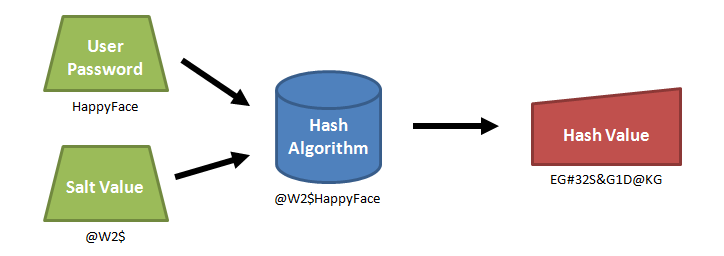
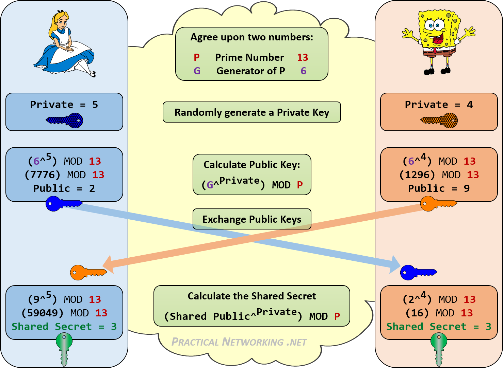
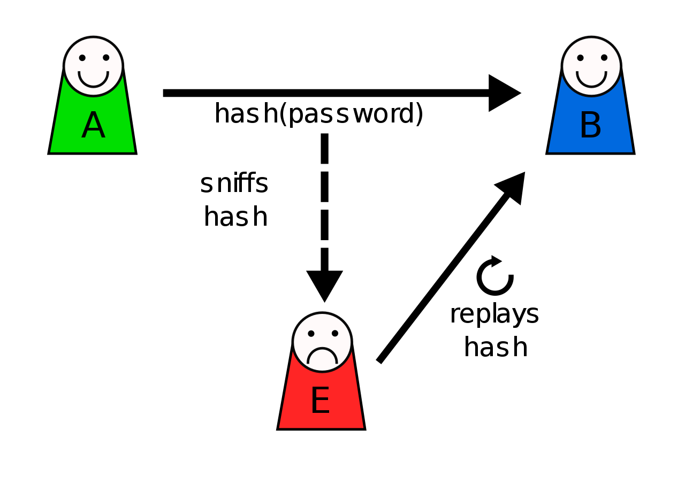
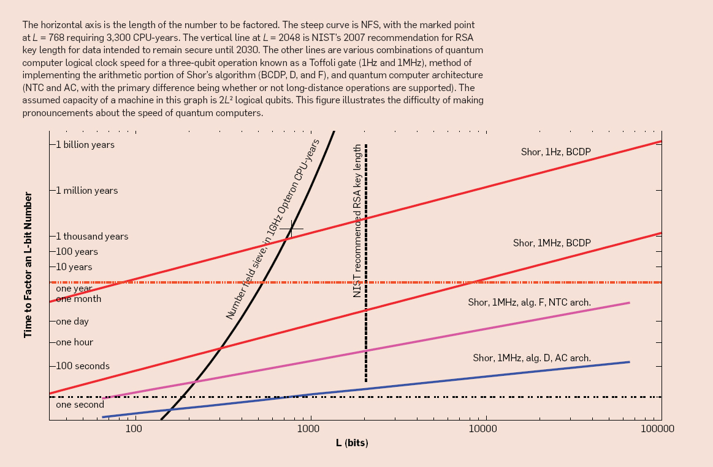

## Data security

| Feature          | Hash | HMAC      | Digital Signature |
|------------------|------|-----------|-------------------|
| Integrity        | Yes  | Yes       | Yes               |
| Authentication   | No   | Yes       | Yes               |
| Non-repudiation  | No   | No        | Yes               |
| Relative Speed   | Fast | Fast      | Slow              |
| Key type         | None | Symmetric | Asymmetric        |
| Can be truncated | Yes  | Yes       | No                |

- **Integrity**: Has the message been altered?
- **Authentication**: Is this entity who they say they are?
- **Non-Repudiation**: Has this entity provided proof that this message actually came from them?
  - Non-Repudiation also provides Authentication as a byproduct.


---
## KDF (Key Derivation Functions)

> PBKDF2, scrypt

  - Used to derive a cryptographically-secure symmetric Secret Key from a less secure password or other input (like a Shared Secret created via a Diffie-Hellman exchange).
  - Very similar to hash functions, but more secure. This is because KDFs produce higher-entropy and more uniformly random outputs.
    - Used both to create encryption keys from passwords and to create cryptographically-secure hashes from passwords
  - Keyed-hash MACs (HMACs) are frequently used as part of KDFs. The input for the KDF may be hashed thousands of times to increase the difficulty of Brute Force Attacks. This is called a Work Factor.


---
## MAC (Message Authentication Code)

> HMAC, PMAC, OMAC

  - Used to ensure data integrity in messages. Similar to Digital Signatures, except much smaller (only a few bytes) and faster.
  1. The Sender uses a MAC algorithm with a Shared Secret on a message's hash to create a cryptographic checksum, called a MAC.
  2. The MAC is attached to the message and sent to the Receiver.
  3. The Receiver uses the same Shared Secret with the same MAC algorithm on the message's hash.
  4. The Receiver compares his MAC with the Sender's MAC. If they match, the message is good and has not been altered en route. The Receiver also knows that the message definitely came from the Sender (and not a Man-in-the-Middle) because only the Receiver and Sender posess the Shared Secret.
  - Faster than Digital Signatures, but doesn't provide Non-Repudiation because the Symmetric Key used to sign the hash is not unique to the Sender.

### HMAC (Keyed-Hash Message Authentication Code)

> HMAC-SHA256, HMAC-MD5, HMAC-SHA1

- HMACs are a type of Keyed Cryptographic hash functions, which are used to dervice MACs.
```
Example:
HMAC-MD5(key="key", message="The quick brown fox jumps over the lazy dog") = 80070713463e7749b90c2dc24911e275
```


---
## HASHING

> - *Unkeyed cryptographic*: MD5 (deprecated), SHA1 (deprecated), SHA2 (SHA256 & SHA512), SHA3, bcrypt
> - *Keyed cryptographic*: HMACs, KMACs, MD6, UMACs, VMACs, BLAKE2
> - *Non-cryptographic*: Buzhash, xxHash, Pearson hashing, MurmurHash
> - *Checksums*: sum8, sum32, fletcher-4, fletcher-32, xor8, Adler-32
>   - *Cyclic Redundancy Checks (CRCs)*: cksum, CRC-16, CRC-32, CRC-64
  - Hashes are one-way functions to ensure data integrity and to obscure/obfuscate passwords.
    - **CRCs** (a common type of checksum) are short and used to detect and/or correct changes in data.
    - **Unkeyed hashes** depend only on input data, intentioanlly designed to be computationally intensive, and are cryptographically secure against brute-force attacks.
    - **Keyed hashes** depend on input data and a Symmetric Key. Much faster than salted hashes. An HMAC is a type of keyed hash.
  - **Salting:** When hashing passwords, it is recommended to salt them by hashing the user's password concatenated with a random unique string tied to that user's account. This eliminates the effectiveness of Rainbow Tables because common passwords that have been salted now create hashes different from what would appear on Rainbow Tables.

| Salted vs Keyed hashes             | Salted hash               | Keyed hash            |
|------------------------------------|---------------------------|-----------------------|
| Primary function                   | Deter brute-force attacks | Ensure data integrity |
| Salt/Key is known to attacker      | Yes                       | No                    |
| Reused between messages            | No                        | Yes                   |
| Relative speed                     | Slow                      | Fast                  |




---
## MFA (Multi-Factor Authentication)

### TOTP (Time-based One-Time Password)
- Used with an Authenticator app that combines a shared symmetric Secret Key with the current timestamp (on a 30s interval) to create a single-use one-time password.
  - An HMAC is used to create the TOTP, which is encoded and truncated down to 6-digits.
  - Only the Authenticator app and the authenticating server know the Secret Key.
  - Based on HMAC-based One-Time Passwords (HOTP)

### FIDO U2F
`TODO`

## KEY EXCHANGE

- #### Diffie-Hellman
  - Used to securely create a Shared Secret for a symmetrically-encrypted interaction. A Key-Derivation Function (KDF) can then be used with the Shared Secret in order to create a cryptographically-secure Secret Key for use with AES.
  - Vulnerable to Man in the Middle attacks if the exchange is not encrypted with RSA.
- #### Diffie-Hellman-RSA (DH_RSA)
  - DH with RSA
  - Bob uses signs his DH Public Key with his RSA Private Key before sending it to Alice.
  - Alice verifies Bob's signature using his RSA Public Key to ensure the DH Public Key is actually from Bob and there is no Man in the Middle.




## ATTACKS

- **Side-channel attack** = Attack based on a weakness in the implementation of a security system, rather than a weakness in the system itself.

  - **Cold-boot attack** = Attacker with physical access reboots into a temporary OS and performs a memory dump to retrieve encryption keys stored in RAM from the previous boot. Exploits the fact that RAM is unencrypted and remains readable seconds to minutes after losing power. Used to circumvent full-disk encryption.

  - **Cache side-channel attack** = (*ex. Meltdown & Spectre*) Attacker takes advantage of the way speculative execution is performed on certain CPUs to gain access to protected areas of memory.

- **Man-in-the-middle attack (MITM)** = Attacker relays or alters messages between two parties who believe they're communicating with each other.

  - **ARP spoofing / ARP poisoning** = Attacker replies to ARP messages that are requesting the MAC of a specific IP. This allows the attacker to get their MAC associated with the IP of another host, usually the default gateway. The attacker can then perform a DoS or MITM attack by intercepting and relaying traffic.

  - **Replay attack** = Attacker repeats or delays a valid message, fooling a party into believing the attacker is legitimate.




### Breaking encryption
  "Big O" time complexity


  - classical brute-force time complexity of breaking a cryptographic hash = **O(2<sup>N</sup>)**
    - A SHA256 hash has a search space of **2<sup>256</sup>** <sup>[3]</sup>

  - quantum brute-force time complexity of factoring an RSA key using Shor's algorithm = **O(72(logN)<sup>3</sup>)** <sup>[4]</sup>



[1]: https://strongarm.io/blog/how-https-works/
[2]: https://www.codeproject.com/Articles/326574/An-Introduction-to-Mutual-SSL-Authentication
[3]: https://www.youtube.com/watch?v=S9JGmA5_unY&t=1s
[4]: https://cs.stackexchange.com/questions/16684/shors-algorithm-speed
