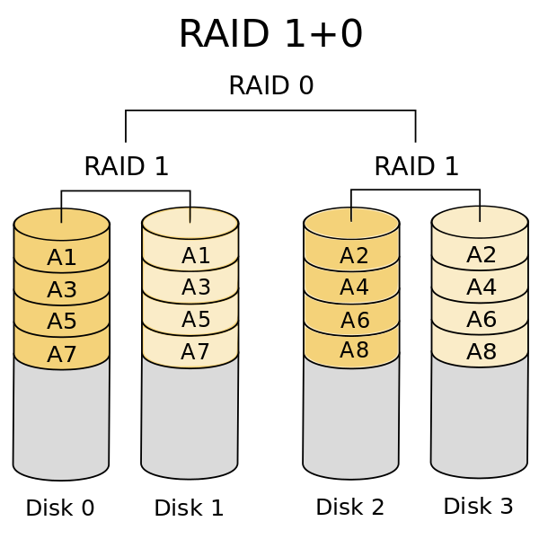

## LOGICAL VOLUME MANAGEMENT (LVM)

### Examples

Extending */var* XFS filesystem with LVM:
```bash
1. fdisk /dev/sdb                      # Create partition from new disk.
2. pvcreate /dev/sdb1                  # Create a physical volume from the new partition.
3. vgextend vgname /dev/sdb1           # Add the new physical volume to the relevant volume group.
4. pvdisplay                           # Show the number of new extents available.
5. lvextend -l +127999 /dev/centos/var # Extend the relevant logical volume by adding 127,999 free extents.
6. xfs_growfs /var                     # Grow the filesystem on the extended logical volume.
```

### Physical volumes (PV)

- `pvdisplay` or `pvscan`        = Show physical volumes.
- `pvcreate /dev/sdb`            = Create a physical volume.
- `pvremove /dev/sdb1 /dev/sdc1` = Remove physical volumes on partitions *sdb1* and *sdc1*.
- `pvmove /dev/sdb1 /dev/sdb2`   = Copy all data from *sdb1* to *sdb2*.

### Logical volumes (LV)

- `lvdisplay` or `lvscan`            = Show logical volumes.
- `lvcreate -l 2500 centos -n vol_1` = Create a new volume called *vol_1* with *2500* extents in vgroup *centos*.
- `lvextend -L 1.5G /dev/mapper/LV1` = Extend volume *LV1* to *1.5 GB*.
- `lvreduce -l -200 /dev/mapper/LV1` = Reduce volume *LV1* by *200* extents.

### Volume groups (VG)

- `vgdisplay` or `vgscan`            = Show volume groups.
- `vgcreate VG1 /dev/sdb1 /dev/sdc1` = Create a volume group called *VG1*, containing physical volumes *sdb1* and
                                       *sdc1*.
- `vgextend VG1 /dev/sdb1`           = Add physical volume sdb1 to volume group VG1.


---
## [COMPRESSION](https://clearlinux.org/news-blogs/linux-os-data-compression-options-comparing-behavior)
`TODO`

- **See also:**
  - [Squash compression benchmark](https://quixdb.github.io/squash-benchmark/#results)

[BtrFS compression benchmarks:](https://git.kernel.org/pub/scm/linux/kernel/git/mason/linux-btrfs.git/commit/?h=next&id=5c1aab1dd5445ed8bdcdbb575abc1b0d7ee5b2e7)
| Method  | Ratio | Compress MB/s | Decompress |
|---------|-------|---------------|------------|
| None    |  0.99 |           504 |        686 |
| lzo     |  1.66 |           398 |        442 |
| zlib    |  2.58 |            65 |        241 |
| zstd 1  |  2.57 |           260 |        383 |
| zstd 3  |  2.71 |           174 |        408 |
| zstd 6  |  2.87 |            70 |        398 |
| zstd 9  |  2.92 |            43 |        406 |
| zstd 12 |  2.93 |            21 |        408 |
| zstd 15 |  3.01 |            11 |        354 |

| compression algorithms | gzip | bzip2 | xz | lzip | lzma | zstd |
|------------------------|------|-------|----|------|------|------|
| Released               |      |       |    |      |      |      |
| Compression speed      |      |       |    |      |      |      |
| Decompression speed    |      |       |    |      |      |      |
| Compression ratio      |      |       |    |      |      |      |

| Archive formats | tar | zip | 7z | tar.gz |
|-----------------|-----|-----|----|--------|
|                 |     |     |    |        |

### Tar

- `tar xzvf myarchive.tar.gz` = Extract myarchive.tar.gz to current path (*xtract ze v'ing files*).
  - `x` = Extract.
  - `z` = Decompress with gzip (only works with extracting *tar.gz* or *.tgz* tarballs).
  - `v` = Be verbose.
  - `f` = Work in file mode (rather than tape mode).
<br><br>
- `tar czvf myarchive.tar.gz dir1/ dir2/` = Create *myarchive.tar.gz* from *dir1* and *dir2*
                                            (*create ze v'ing files*).

### 7zip

- `7za x myarchive.7z` = Extract *myarchive.7z* to current path (DO NOT USE THE 'e' SWITCH, USE 'x' INSTEAD TO PRESERVE FILEPATHS).
<br><br>
- `7za a -mx=10 myarchive.7z dir1/ dir2/` = Create *myarchive.7z* from *dir1* and *dir2*.
  - `-mx=10` = Use compression lvl 10.


---
## DISKS & MOUNTS

- **See also:**
  - [Fixing 3.3v Pin issue in SATA drives](https://imgur.com/a/A0JXgrQ)
<br><br>
- `partprobe` = Scan for new disks.
<br><br>
- `lsblk -f` = Show disk tree layout, including logical volumes.
 - `-f`      = Show filesystem type.
<br><br>
- `df -Th` = Show space used by mounted drives.
  - `-h`   = Make output human-readable.
  - `-T`   = Show filesystem type.
<br><br>
- `blkid` = Show partition UUIDs.
<br><br>
- `fdisk -l`       = Show drives and their partition tables.
- `fdisk /dev/sdb` = Edit the partition table of sdb.
<br><br>
- `mount`                                     = Show mounted volumes and their mount locations.
- `mount –o remount,rw /dev/sda1 /mountpoint` = Remount drive with read-write permissions.

### [Disk testing](https://calomel.org/badblocks_wipe.html)

- `badblocks -b 4096 -s -v -w /dev/sdb` = Destructively test disk sdb for bad data blocks (useful for testing new drive).
- `bonnie++`
- `dd if=/dev/zero of=./test1.img bs=1G count=1 oflag=dsync` = [Test disk write speed.](https://www.cyberciti.biz/faq/howto-linux-unix-test-disk-performance-with-dd-command/)

---
### SMART

#### SMART testing

- `smartctl -t long /dev/sdc` = Start a long HDD self test. After the test is done (could take 12+ hours), check the results with `smartctl -a /dev/sdc`.
<br><br>
- `smartctl -a /dev/ | grep Current_Pending_Sector`         = Pending sector reallocations.
- `smartctl -a /dev/ | grep Reallocated_Sector_Ct`          = Reallocated sector count.
- `smartctl -a /dev/ | grep UDMA_CRC_Error_Count`           = UDMA CRC errors.
- `diskinfo -wS`                                            = HDD and SSD write latency consistency (unformatted drives only!).
- `smartctl -a /dev/ | grep Power_On_Hours`                 = HDD and SSD hours.
- `nvmecontrol logpage -p 2 nvme0 | grep “Percentage used”` = NVMe percentage used.

#### SMART field names

- `Normalized value` = Commonly referred to as just "value". This is a most universal measurement, on the scale from 0
                       (bad) to some maximum (good) value. Maximum values are typically 100, 200 or 253. Rule of thumb
                       is: high values are good, low values are bad.
- `Threshold` = The minimum normalized value limit for the attribute. If the normalized value falls below the threshold,
                the disk is considered defective and should be replaced under warranty. This situation is called "T.E.C."
                (Threshold Exceeded Condition).
- `Raw value` = The value of the attribute as it is tracked by the device, before any normalization takes place. Some
                raw numbers provide valuable insight when properly interpreted. These cases will be discussed later on.
                Raw values are typically listed in hexadecimal numbers.

|[SMART attributes](https://www.z-a-recovery.com/manual/smart.aspx)         |                                                                                                                                                                                                                                                                                                                                                                                                                                                                                                                       |
|---------------------------------------------------------------------------|-----------------------------------------------------------------------------------------------------------------------------------------------------------------------------------------------------------------------------------------------------------------------------------------------------------------------------------------------------------------------------------------------------------------------------------------------------------------------------------------------------------------------|
| Reallocated sectors count                                                 | How many defective sectors were discovered on drive and remapped to spare sectors. Low values in absence of other fault indications point to a disk surface problem. Raw value indicates the exact number of such sectors.                                                                                                                                                                                                                                                                                            |
| Current pending sectors count                                             | How many suspected defective sectors are pending "investigation." These will not necessarily be remapped. In fact, such sectors my be not defective at all (e.g. if some transient condition prevented reading of the sector, it will be marked "pending") - they will be then re-tested by the device off-line scan1 procedure and returned to the pool of serviceable sectors. Raw value indicates the exact number of such sectors.                                                                                |
| Off-line uncorrectable sectors count                                      | Similar to "Reallocated sectors count". Indicates how many defective sectors were found during the off-line scan1.                                                                                                                                                                                                                                                                                                                                                                                                    |
| Read error rate, read error retry rate, write error rate, seek error rate | Rate at which the specified errors occur. Lower value indicates more errors. Retries do not necessarily indicate a persistent problem, but one should proceed with caution if any of these attributes is degraded.                                                                                                                                                                                                                                                                                                    |
| Recalibration retries                                                     | How often the drive is unable to recalibrate at the first attempt. Raw value may show the exact number of recalibration events (at least with some vendors) but this should be taken with a grain of salt.                                                                                                                                                                                                                                                                                                            |
| Spin up time                                                              | Low value indicates that a drive takes longer than expected to spin up to its rated speed. May indicate either a controller or a spindle bearing problem.                                                                                                                                                                                                                                                                                                                                                             |
| Spin retry count                                                          | How many times the drive was unable to spin its platters up to the rated rotation speed in due time. Spin-up attempt was aborted and retried. This typically indicates severe controller or bearing problem, but may sometimes be caused by power supply problems.                                                                                                                                                                                                                                                    |
| Drive start/stop count, Power off/retract cycle count                     | Estimation of drive wear. Vendor estimates the supposed device lifetime and the number of cycles. The value for these attributes is then computed based on this estimation. The T.E.C. condition with one of these attributes does not necessarily indicate a drive failure, but rather suggests that a drive should be considered unreliable due to the wear and tear. Raw values are typically just the count of events.                                                                                            |
| Power on hours count, Head flying hours count                             | Normalized values are computed similar to the above. Despite what the name suggests, the raw value of the attribute is stored using all sorts of measurement units (hours, half-hours, or ten-minute intervals to name a few) depending on the manufacturer of the device.                                                                                                                                                                                                                                            |
| Temperature                                                               | Device temperature, if the appropriate sensor is fitted. Lowest byte of the raw value contains the exact temperature value (in Celsius).                                                                                                                                                                                                                                                                                                                                                                              |
| Ultra DMA CRC error rate                                                  | Low value of this attribute typically indicates that something is wrong with the connectors and/or cables. Disk-to-host transfers are protected by CRC error detection code when Ultra-DMA 66 or 100 is used. So if the data gets garbled between the disk and the host machine, the receiving controller senses this and the retransmission is initiated. Such a situation is called "UDMA CRC error." Once the problem is rectified (typically by replacing a cable), the attribute value returns to normal levels. |
| G-sense error rate                                                        | Indicates if errors are occurring from physical shocks to the drive (either due to the environmental factors or due to improper installation). The hard drive must be fitted with the appropriate sensor to get information about the G-loads. This attribute is mainly limited to notebook (2.5") drives. Once the operation conditions are corrected, the attribute value will return to normal.                                                                                                                    |


---
## FILES & FILESYSTEMS

### Metadata

- `stat file.txt`         = Get file metadata on file.txt.
- `atime` (*access time*) = Last time file's contents were read.
- `mtime` (*modify time*) = Last time file's contents were changed.
- `ctime` (*change time*) = Last time file's inode was changed (permissions, ownership, name, hard links, etc.).

[inode:](http://www.linfo.org/inode.html)
  > A special data structure holding a file's metadata, contains the file's physical address on the storage medium, size,
  > permissions, and modification timestamps. The file that the user interacts with is only a pointer to its
  > corresponding inode.

### Sizing

- `du -sh /home/alice` = Display disk space used by specified directory or file.
  - `-s` (*summarize*)  = List total storage used by entire directory and all subdirectories.
  - `-h` (*human*)      = Use human-readable format for filesizes (ex. `8.7M` instead of `8808`).
<br><br>
- `du -d 1 -h /` = List the sizes of each directory one level beneath the specified directory.
  - `d 1` (*depth*) = Recurse at a depth of 1 directory.

---
## SAMBA

- **See also:**
  - [Samba wiki](https://wiki.samba.org/index.php/Main_Page)
<br><br>
- Enable debug logging:
```
/etc/samba/smb.conf.client-debug

[global]
max log size = 0                  # No log file size limitation.
log file = /var/log/samba/log.%I  # Specific log file name.
log level = 3                     # Set the debug level.
debug pid = yes                   # Add the pid to the log.
debug uid = yes                   # Add the uid to the log.
debug class = yes                 # Add the debug class to the log.
debug hires timestamp = yes       # Add microsecond resolution to timestamp.
```

### Linux-Windows interoperability

- **See also:**
  - [Mapping shares between Windows and RHEL](https://www.redhat.com/sysadmin/samba-windows-linux)
  - [Mapping Windows shares on Linux](https://linuxize.com/post/how-to-mount-cifs-windows-share-on-linux/)
  - [Configure Ubuntu for Samba + Winbind + Kerberos](https://serverfault.com/questions/135396/how-to-authenticate-linux-accounts-against-an-active-directory-and-mount-a-windo)
<br><br>
- `smbclient -U user -L 192.168.1.122` = Check Windows share availability.
- `mount -t cifs -o credentials=/<CREDENTIALS_FILE> //WIN_SHARE_IP/<SHARE_NAME> /<MOUNT_PATH>` = Mount Windows share.
  - Create credentials file:
    ```
    username=<USERNAME>
    password=<PASSWORD>
    domain=<DOMAIN>
    ```
  - `chown root:root /<CREDENTIALS_FILE> && chmod 0600 /<CREDENTIALS_FILE>` = Secure credentials file.

---
## NFS

### Server

1. `yum install nfs-utils`
2. `systemctl enable nfs`
3. `systemctl start nfs`
4. create entry in `/etc/exports` (see examples at bottom of man page for `exports`)
`/[mountpoint being shared] [authorized ips or fqdns]([mount options])`
ex: `/mirror 192.168.1.1/24(rw)`
5. `exportfs -a`
6. `sync`

### Client

7. `mount -t nfs [server ip or fqdn]:/[directory being shared] /[local mount location]`
8. `showmount`
9. create entry in `/etc/fstab`
`[server ip or fqdn]:/[directory being shared] /[local mount location] nfs defaults 0 0`
ex: `10.0.0.10:/data  /mnt/data  nfs  defaults  0 0`


---
## MISC

### Hard & symbolic links

- `ln /home/sourcefile.txt /var/hardlink.txt` = Create hard link to file (`ln -s` for soft/symbolic link).

```
Hard links create an additional pointer to a file’s inode and remains even if the original file from which the link
was created is deleted. Similar to copying a file but without taking up extra space on the physical storage medium.

Symbolic links can be made for directories as well as files and work across partitions (unlike hard links), but
break if the location they're pointing to is deleted. Similar to Windows shortcuts.
```

### [Transfer root Linux installation to another drive:](https://askubuntu.com/questions/741723/moving-entire-linux-installation-to-another-drive)

1. Boot from a live OS and use `gparted` to copy the source drive's boot and root partitions to the target drive.
2. Right-click the new partitions on the target drive and generate a new UUID for each.
3. Mount the target drive and bind mount `/dev`, `/run`, `/proc`, and `/sys` (`mount -o bind /src /dest`) from the currently booted live OS to the target drive.
4. `chroot` into the target drive.
5. Edit `fstab` and replace the copied partition's UUID with the new UUID.
6. Make sure the target drive's `/boot` directory contains a Linux image. If not, copy the directory from the source drive manually.
7. Run `grub-mkconfig -o /boot/grub/grub.cfg` or `update-grub` (if `update-grub` is installed).
8. Reboot. if you're dropped into an emergency shell, try regenerating grub.

### How VMWare snapshots work

In VMware VMs, the virtual disk is a .vmdk file residing on a data store (LUN). When a snapshot is created in
Snapshot Manager, the original disk becomes read-only, and all the new data changes are written into a temporary
.vmdk delta disk, pointing to the original one. The delta disk is the difference between the current state of
the virtual disk and the state at the moment the snapshot was taken. After a snapshot is deleted (committed),
the .vmdk delta disk is merged with the original .vmdk file, and it returns to read-write mode.

If the VM is reverted to the snapshot, the temporary .vmdk delta disk is simply deleted and the VM begins writing
to its original disk.

Snapshots are not backups because if the original disk's data is lost, the delta .vmdk becomes useless as it only
contains the changes to the original data, not the data itself.

### Storage latency

- **See also:**
  - [Interactive latency](https://colin-scott.github.io/personal_website/research/interactive_latency.html)
  - [How much faster is memory than flash?](https://stackoverflow.com/questions/1371400/how-much-faster-is-the-memory-usually-than-the-disk)
```
Latency Comparison Numbers (~2012)
----------------------------------
L1 cache reference                           0.5 ns
Branch mispredict                            5   ns
L2 cache reference                           7   ns .................... 14x slower than L1 cache
Mutex lock/unlock                           25   ns
Main memory reference                      100   ns .................... 20x slower than L2 cache, 200x L1 cache
Compress 1K bytes with Zippy             3,000   ns        3 us
Send 1K bytes over 1 Gbps network       10,000   ns       10 us
Read 4K randomly from SSD              150,000   ns      150 us ........ ~1GB/sec SSD
Read 1 MB sequentially from memory     250,000   ns      250 us
Round trip within same datacenter      500,000   ns      500 us
Read 1 MB sequentially from SSD      1,000,000   ns    1,000 us    1 ms  ~1GB/sec SSD, (4x slower than memory)
Disk seek                           10,000,000   ns   10,000 us   10 ms  20x datacenter roundtrip
Read 1 MB sequentially from disk    20,000,000   ns   20,000 us   20 ms  80x slower than memory, 20x slower than SSD
Send packet CA->Netherlands->CA    150,000,000   ns  150,000 us  150 ms  .150 seconds
```

 <sup>[9]</sup>


[9]: https://blog.ssdnodes.com/blog/what-is-raid-10-vps/
